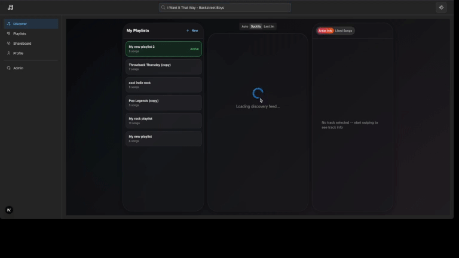
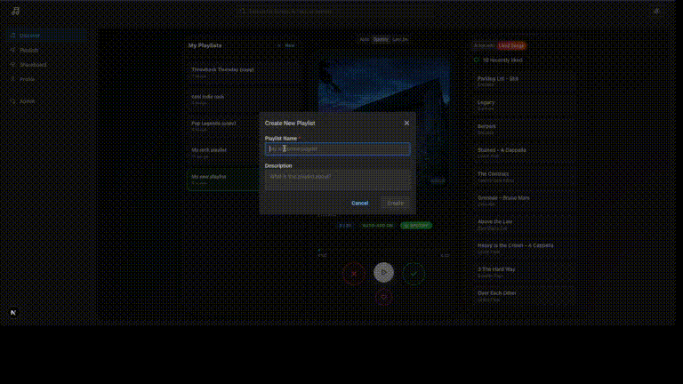
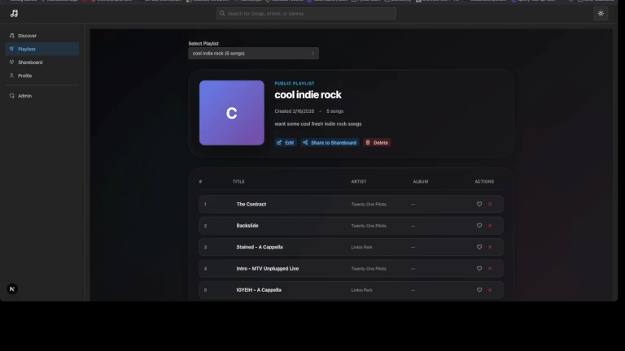

# SpotiSwipe

A music discovery social app where you swipe to discover new music, build custom playlists, and share them with a community. Powered by Spotify for playback/playlists and Last.fm for discovery recommendations.

## Features

### Swipe to Discover
Tinder-style card swiping (drag gestures + buttons) to like, skip, or superlike songs.


### Search-Based Discovery
Search for songs, artists, or genres to generate a swipe-ready discovery feed.



### Custom Playlists
Create and manage playlists from liked songs, sync to Spotify.





### Social Shareboard
Share playlists publicly, like and comment on others' playlists, follow users.


### Profile and Admin
User profile and admin panel for managing the platform.


## Tech Stack

| Layer | Technology |
|-------|-----------|
| Framework | Next.js 16 (App Router, React 19) |
| API | tRPC 11 (type-safe RPC) |
| Database | PostgreSQL + Prisma 6 ORM |
| Auth | better-auth (Spotify + Last.fm + Google OAuth) |
| UI | Mantine 8 + Tailwind CSS 4 |
| State | TanStack React Query 5 |
| Linting | Biome 2 |
| Runtime | Bun |

## Getting Started

### Prerequisites

- [Bun](https://bun.sh/) (package manager + runtime)
- [PostgreSQL](https://www.postgresql.org/) 14+ (or Docker/Podman)

### Setup

```bash
# Clone the repository
git clone <repo-url>
cd spotiswipe

# Install dependencies
bun install

# Copy environment variables
cp .env.example .env
# Edit .env with your credentials (see Environment Variables below)

# Start PostgreSQL (or use the helper script)
./start-database.sh

# Push database schema
bun run db:push

# Start development server
bun dev
```

The app runs at **http://127.0.0.1:3000** (must use 127.0.0.1, not localhost, for Spotify OAuth compatibility).

## Environment Variables

| Variable | Description |
|----------|-------------|
| `AUTH_SECRET` | better-auth secret (generate with `openssl rand -base64 32`) |
| `AUTH_SPOTIFY_ID` | Spotify app client ID ([create here](https://developer.spotify.com/dashboard)) |
| `AUTH_SPOTIFY_SECRET` | Spotify app client secret |
| `AUTH_GOOGLE_ID` | Google OAuth client ID (optional) |
| `AUTH_GOOGLE_SECRET` | Google OAuth client secret (optional) |
| `LASTFM_API_KEY` | Last.fm API key ([create here](https://www.last.fm/api/account/create)) |
| `LASTFM_API_SECRET` | Last.fm API secret |
| `NEXT_PUBLIC_LASTFM_API_KEY` | Last.fm API key exposed to client (same as LASTFM_API_KEY) |
| `DATABASE_URL` | PostgreSQL connection string |

## Scripts

```bash
bun dev              # Start dev server (turbo mode, 127.0.0.1:3000)
bun run build        # Production build
bun start            # Start production server
bun run check        # Biome lint + format check
bun run check:write  # Auto-fix safe issues
bun run typecheck    # TypeScript type check
bun run db:push      # Push schema to database
bun run db:generate  # Create migration + generate client
bun run db:migrate   # Deploy migrations
bun run db:studio    # Open Prisma Studio GUI
bun run db:seed      # Seed database with sample data
```

## Project Structure

```
src/
  app/                  # Next.js App Router (pages + API routes)
    _components/        # Shared layout: Navbar, AuthProvider, HeaderSearch, SignIn
    api/auth/           # better-auth catch-all handler + Last.fm callback
    api/trpc/           # tRPC HTTP handler
    (app)/dashboard/    # Swipe discovery page (PlayerCard, PlaylistStack, LyricsPanel)
    (app)/playlist/     # Playlist management
    (app)/shareboard/   # Social feed
    (app)/profile/      # User profile
    (app)/admin/        # Admin panel
  lib/
    services/           # Client-side API wrappers (spotify, lastfm, discovery)
    hooks/              # Custom hooks (useDiscoveryFeed, useSpotifyPlayer, etc.)
  server/
    auth/               # better-auth config + Last.fm API client
    spotify/            # Spotify API integration (search, playback, playlists)
    api/routers/        # tRPC router definitions
    db.ts               # Prisma client singleton
    logger.ts           # Structured logging utility
    errors.ts           # Error codes and AppError class
  trpc/                 # Client-side tRPC + React Query setup
prisma/schema.prisma    # Database schema
```

## Architecture

```
Browser  -->  Next.js App Router  -->  tRPC Routers  -->  Prisma  -->  PostgreSQL
                    |                       |
              Mantine UI            Spotify API Client
              React Query           Last.fm API Client
                    |
              better-auth Session
              (Spotify / Last.fm / Google OAuth)
```

- **Pages** use React Server Components with client components for interactivity
- **tRPC** provides end-to-end type safety between client and server
- **Prisma** manages database access with generated TypeScript client
- **better-auth** handles OAuth with Spotify (built-in), Last.fm (custom callback), and Google
- **Path alias**: `~/*` maps to `./src/*`

## License

MIT
