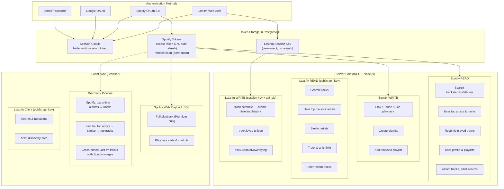
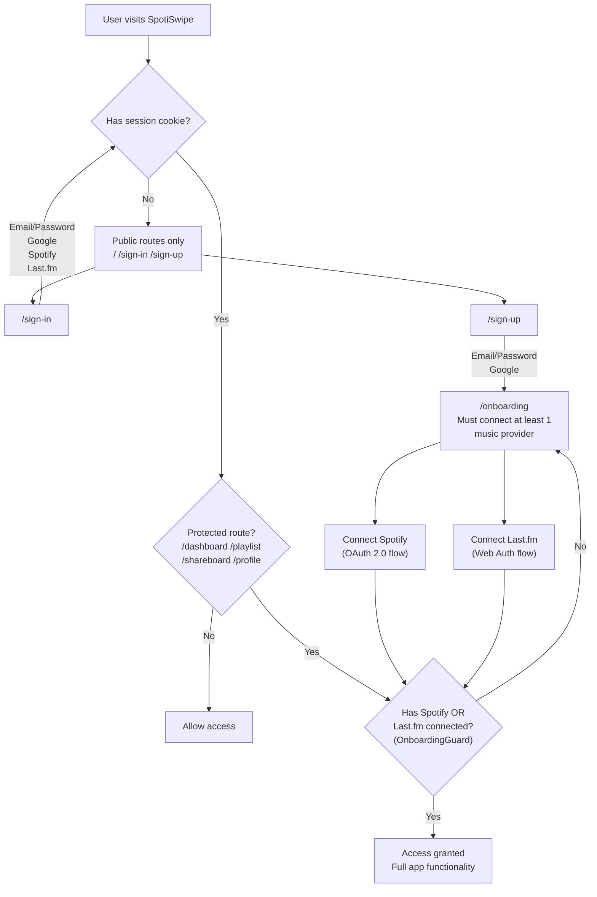

# SpotiSwipe Authentication & Authorization Flow

## Diagram 1: Authentication Flows

```mermaid
sequenceDiagram
    participant U as User/Browser
    participant App as SpotiSwipe App
    participant BA as better-auth Server
    participant DB as PostgreSQL
    participant SA as Spotify Accounts
    participant LA as Last.fm Auth
    participant LAPI as Last.fm API

    Note over U,LAPI: SPOTIFY — OAuth 2.0 Authorization Code Flow

    U->>App: Click "Sign in with Spotify"
    App->>BA: signIn.social({ provider: "spotify" })
    BA->>SA: GET /authorize (client_id, redirect_uri, scopes, state)
    Note right of SA: Scopes requested:<br/>streaming, user-read-private,<br/>user-read-email, user-read-playback-state,<br/>user-modify-playback-state,<br/>user-read-recently-played,<br/>user-top-read, user-library-read,<br/>playlist-read-private,<br/>playlist-modify-public,<br/>playlist-modify-private
    SA->>U: Spotify consent screen
    U->>SA: Approve permissions
    SA->>BA: GET /api/auth/callback/spotify?code=xxx&state=xxx
    BA->>SA: POST /api/token (exchange authorization code)
    SA-->>BA: access_token, refresh_token, expires_in (3600s)
    BA->>DB: Store Account record<br/>(providerId="spotify", accessToken,<br/>refreshToken, accessTokenExpiresAt)
    BA->>DB: Create or link User + create Session
    BA-->>U: Set cookie "better-auth.session_token"<br/>Redirect → /onboarding or /dashboard

    Note over U,LAPI: LAST.FM — Web Auth Flow (MD5 Signature)

    U->>App: Click "Sign in with Last.fm"
    App->>LA: Redirect to last.fm/api/auth?api_key=xxx&cb=callback_url
    LA->>U: Last.fm consent screen
    U->>LA: Approve
    LA->>App: GET /api/auth/callback/lastfm?token=xxx
    App->>LAPI: GET auth.getSession (token + api_key + api_sig MD5)
    LAPI-->>App: Permanent session key (never expires)
    App->>LAPI: GET user.getInfo (sk=sessionKey)
    LAPI-->>App: username, profile data, image
    App->>DB: Store Account record<br/>(providerId="lastfm", accessToken=sessionKey,<br/>accountId=username)
    App->>DB: Link to existing User (trustedProviders) or create new
    App-->>U: Set cookie "better-auth.session_token"<br/>Redirect → /onboarding or /dashboard

    Note over U,LAPI: EMAIL/PASSWORD — Direct Auth (better-auth)

    U->>App: Enter email + password
    App->>BA: signUp.email({ email, password, name })
    BA->>DB: Create User with hashed password in Account
    BA->>DB: Create Session
    BA-->>U: Set cookie, redirect → /onboarding

    Note over U,LAPI: GOOGLE — OAuth 2.0 (better-auth social)

    U->>App: Click "Continue with Google"
    App->>BA: signIn.social({ provider: "google" })
    BA->>SA: Standard OAuth 2.0 flow with Google
    BA->>DB: Create/link User + Account(providerId="google")
    BA-->>U: Set cookie, redirect

    Note over U,LAPI: TOKEN LIFECYCLE

    rect rgb(40, 80, 40)
        Note over BA,SA: Spotify Token Auto-Refresh (every ~55 min)
        BA->>DB: getSpotifyToken(userId) — check accessTokenExpiresAt
        alt Token expired (with 60s buffer)
            BA->>SA: POST /api/token (grant_type=refresh_token)
            SA-->>BA: New access_token + expires_in
            BA->>DB: Update Account(accessToken, accessTokenExpiresAt)
        end
    end

    rect rgb(80, 40, 40)
        Note over App,LAPI: Last.fm Session Key — Permanent, never expires
        Note over App,LAPI: Stored as Account.accessToken, no refresh needed
    end
```

## Diagram 2: API Authorization Matrix

## Diagram 3: Onboarding & Route Protection

## Last.fm Write API Capabilities

| Endpoint | Method | Auth Required | Description |
|----------|--------|---------------|-------------|
| `track.scrobble` | POST | session key + api_sig | Submit track play to user's history |
| `track.love` | POST | session key + api_sig | Love a track on user's profile |
| `track.unlove` | POST | session key + api_sig | Remove love from a track |
| `track.updateNowPlaying` | POST | session key + api_sig | Set user's "now playing" status |

**Important**: Last.fm does NOT support playlist creation/management via API (deprecated). Playlist export is Spotify-only.

## Token Summary

| Provider | Token Type | Lifetime | Refresh | Storage |
|----------|-----------|----------|---------|---------|
| Spotify | access_token | ~1 hour | Auto via refresh_token | Account.accessToken |
| Spotify | refresh_token | Permanent | Rotated on use | Account.refreshToken |
| Last.fm | session key | Permanent | Not needed | Account.accessToken |
| better-auth | session_token | Configurable | Cookie-based | Session table + cookie |

## Current vs Needed Implementation

| Feature | Status | Location |
|---------|--------|----------|
| Spotify OAuth + token refresh | Done | `src/server/auth/index.ts`, `src/server/spotify/api.ts` |
| Last.fm auth + session key | Done | `src/app/api/auth/callback/lastfm/route.ts` |
| Spotify search (server) | Done | `src/server/spotify/api.ts` |
| Spotify playback (server) | Done | `src/server/spotify/api.ts` |
| Spotify playlist create/sync | Done | `src/server/api/routers/spotify.ts` |
| Spotify Web Playback SDK | Done | `src/lib/hooks/useSpotifyPlayer.ts` |
| Last.fm read endpoints (server) | Done | `src/server/auth/lastfm.ts` |
| Last.fm read endpoints (client) | Done | `src/lib/services/lastfm.ts` |
| Discovery pipeline | Done | `src/lib/services/discovery.ts` |
| Last.fm scrobble | Done | `src/server/auth/lastfm.ts`, `src/server/api/routers/lastfm.ts` |
| Last.fm love/unlove | Done | `src/server/auth/lastfm.ts`, `src/server/api/routers/lastfm.ts` |
| Last.fm now playing | Done | `src/server/auth/lastfm.ts`, `src/server/api/routers/lastfm.ts` |
| Last.fm write tRPC routes | Done | `src/server/api/routers/lastfm.ts` |
| **Client-side scrobble integration** | **TODO** | Auto-scrobble when track finishes playing |
